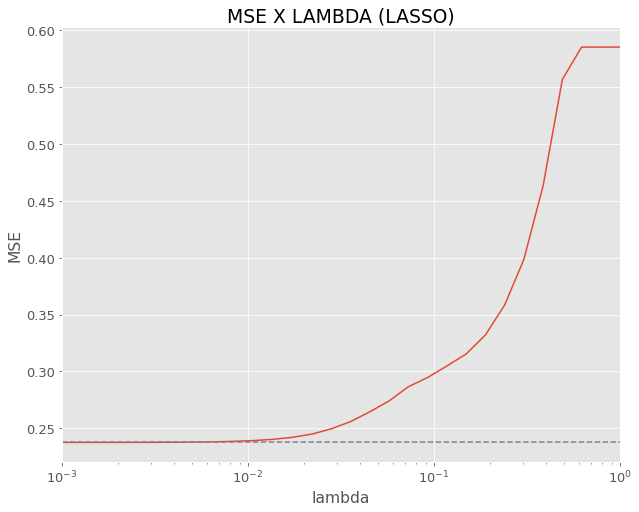
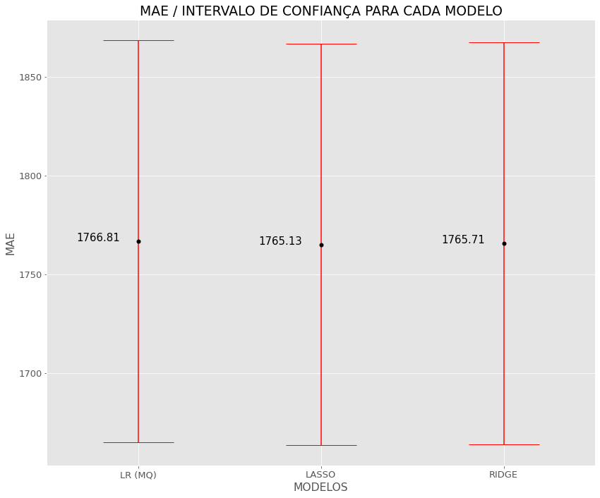
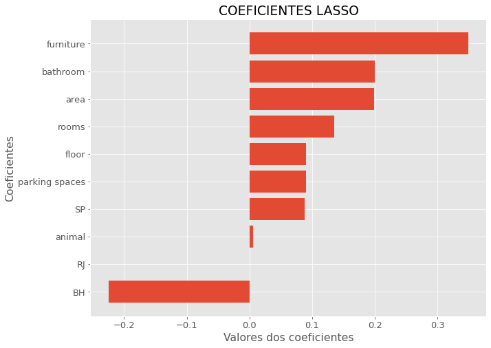
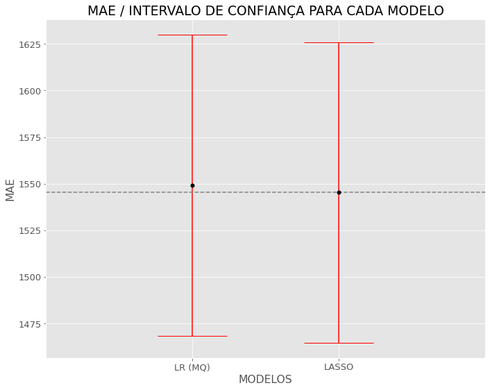
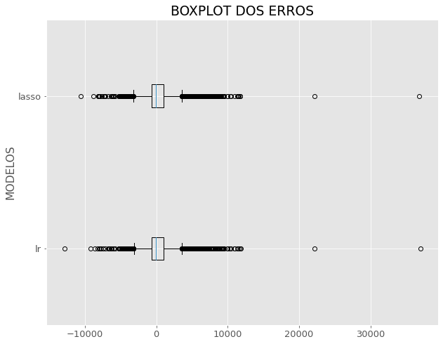

# Lista 01 
**Exercı́cio 1**
* Considere o banco <a href="https://www.dropbox.com/s/8auhk2zaogovjvn/houses_to_rent_v2.csv?dl=0">houses_to_rent_v2</a>, que contém o valor (em reais) do aluguel de imóveis no Brasil. Você pode trabalhar apenas com os imóveis localizados em São Paulo, Rio de Janeiro e Belo Horizonte.
1. Divida o conjunto de dados em para treinamento e teste. Explique como decidiu qual porcentagem deixar
para cada um.
2. Utilizando o conjunto de treinamento, ajuste uma regressão (i) via mı́nimos quadrados, (ii) via lasso (usando validação-cruzada no treinamento para escolher λ) e (iii) (Pós-graduação apenas) regressão ridge. Qual o melhor valor de λ encontrado para o lasso?
3. Qual dos métodos acima apresentou melhores resultados? Responda essa pergunta utilizando o conjunto de teste e o melhor valor de λ encontrado. Inclua os intervalos de confiança para o risco preditivo nos seus resultados.
4. Interprete os resultados do melhor modelo encontrado (via coeficientes). Ele faz sentido?
5. Includa todas as interações entre as variáveis observadas e repita o ajuste do método dos mínimos quadrados e o lasso. Como esses ajustes se comparam em relação aos anteriores? Qual foi o melhor modelo encontrado?Esses resultados são esperados?

# Respostas

1.  Foi divido em 70% para treino e 30% para teste - essa % foi escolhida dado que 30% do dataset corresponde a 2593 linhas , dados  suficientes para se ter uma estimativa precisa do risco. A separação entre treino e teste foi realizada antes do processamento dos dados para evitar data leakage.

2. O melhor valor de lambda que minimiza o erro quadrático médio encontrado a partir da validação cruzada foi 0.001.

3. Melhor modelo encontrado foi o lasso para este caso, todos os modelos apresentaram resultados parecidos. Lasso apresenta o menor ERRO MÉDIO ABSOLUTO.

| MODELOS | MAE | IC_LOWER | IC POWER |
|---------|-----|--------- |----------|
| LR (MQ) |1766.81  | 1664.95|1868.68|
| LASSO |1765.13|1663.59|1866.67|
| RIDGE |  1765.71|  1664.08|1867.35|

4.  Atráves dos coeficientes, pode-se concluir que atritbutos como Furniture, Bathroom e area estão positivamente ligadas ao preço do aluguel. Imóveis em BH tendem a ter o preço do alguel menor que SP e RJ. Essas constatações fazem total sentido tendo em vista que Imóveis mobiliados , com maior area e mais banheiros têm o valor do alugel maior do que imóveis mais simples.

5.    Foi observado uma melhora no desempenho tendo em vista que com as interações os modelos se ajustaram melhor aos dados. A regressão via Lasso se saiu melhor. A penalização faz com que o modelo fique menos flexivel aumentando o viés e diminuindo a variância tento um risco estimado melhor. Diferente da regressão via mínimos quadrados onde não tem nenhum termo para regularização, fazendo com que a variância seja maior do que a regressão via lasso. Assim o risco estimado da regressão via mínimos quadrados seja um pouco maior.

	
#### Com o boxplot dos erros é possível verificar que a regressão via mínimos quadrados apresenta erros um pouco mais acentuados que a regressão via lasso.

